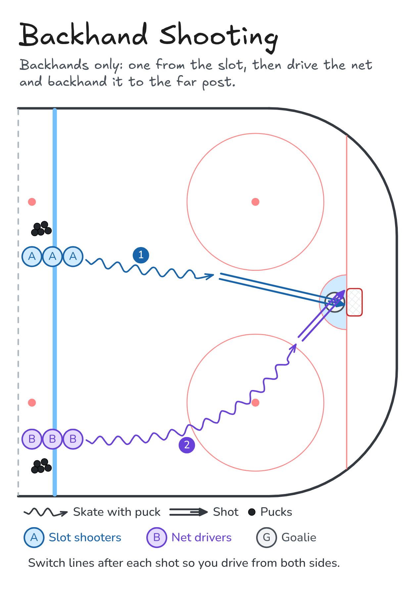

# Backhand Shooting

Backhands only: one from the slot, then drive the net and backhand it to the far post.

**Tags:** `half-ice`, `shooting`

[All drills](../README.md) · [Drill page](backhand-shooting/) · [Animation](../media/backhand-shooting/backhand-shooting-anim.html) · [PNG](../media/backhand-shooting/backhand-shooting.png) · [Excalidraw](../media/backhand-shooting/backhand-shooting.excalidraw)

The drill page embeds the HTML animation. The PNG is the still diagram and the home-page thumbnail.

## Coaching points

- Puck on the backhand side, near your back foot.
- Sweep it forward and roll your wrists to lift it.
- Follow through high toward the target.
- Driving the net: protect the puck with your body, aim far post.
- Follow your shot for the rebound.

## How it runs

1. Two lines at the blue line with pucks.
2. Slot line: carry into the slot and shoot a backhand.
3. Wing line: drive the net from the wing and backhand it to the far post.
4. Switch lines after each shot so you drive from both sides.

Open the Excalidraw file above in [Excalidraw](https://excalidraw.com) to change the diagram.

## Related drills

- [Give-and-Go to Shot](give-and-go-shot.md)
- [Rebounds: In-tight Hands](rebounds-in-tight.md)
- [Tip-and-Dig Shooting](tip-and-dig-shooting.md)

