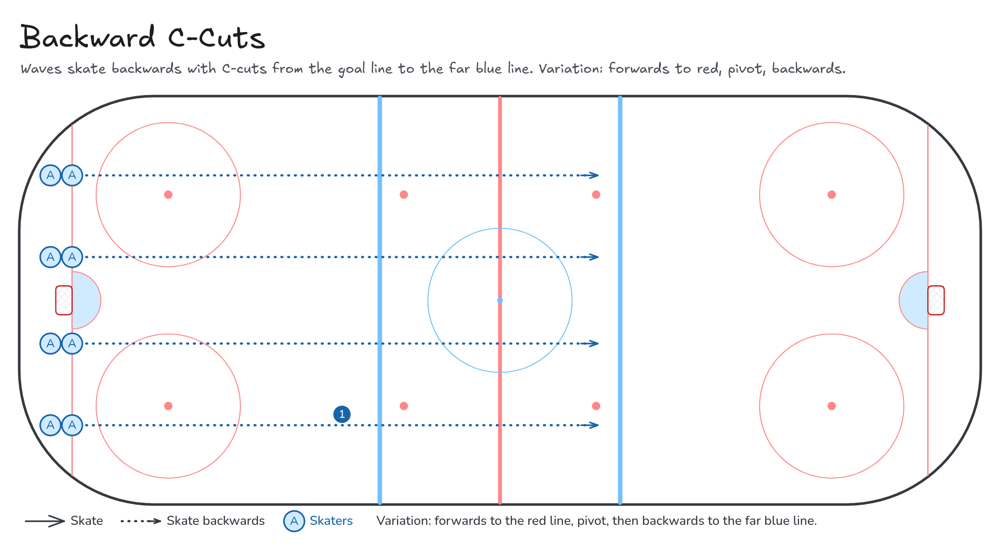

# Backward C-Cuts

Waves skate backwards with C-cuts from the goal line to the far blue line. Variation: forwards to red, pivot, backwards.

**Tags:** `full-ice`, `skating`

[All drills](../README.md) · [Drill page](backward-c-cuts/) · [Animation](../media/backward-c-cuts/backward-c-cuts-anim.html) · [PNG](../media/backward-c-cuts/backward-c-cuts.png) · [Excalidraw](../media/backward-c-cuts/backward-c-cuts.excalidraw)

The drill page embeds the HTML animation. The PNG is the still diagram and the home-page thumbnail.

## Coaching points

- Sit low like you're in a chair. Chest up, eyes up.
- Push out in a C shape and pull your skate back under you.
- Switch feet each push. Keep your shoulders square.
- Stick on the ice in front of you.
- Pivot: turn your hips, not just your shoulders, and keep your feet moving.

## How it runs

1. 4 lanes on the goal line.
2. Skate backwards with C-cuts to the far blue line.
3. Glide back along the boards.
4. Variation: forwards to the red line, pivot, then backwards to the far blue line.

Open the Excalidraw file above in [Excalidraw](https://excalidraw.com) to change the diagram.

## Related drills

- [Figure-8s with Pivots](figure-8-pivots.md)
- [Crossover Circles: Pivot Race](crossover-circles-pivots.md)
- [Lateral Step-overs with Pivots](lateral-step-overs.md)

