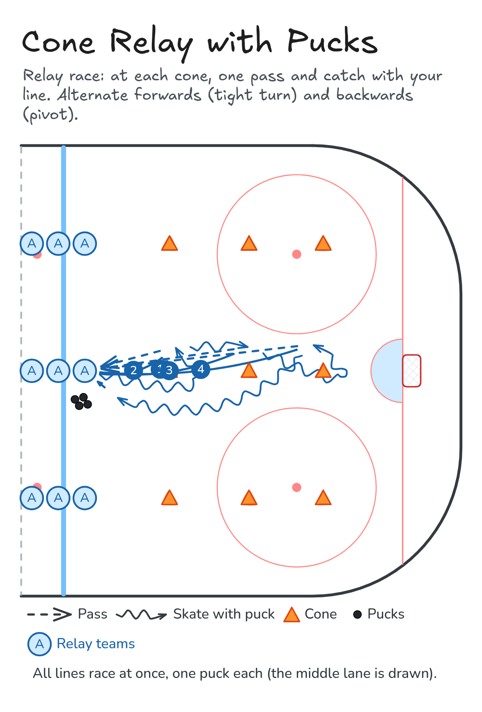

# Cone Relay with Pucks

Relay race: at each cone, one pass and catch with your line. Alternate forwards (tight turn) and backwards (pivot).

**Tags:** `skating`, `passing`

[All drills](../README.md) · [Drill page](cone-relay-with-pucks/) · [Animation](../media/cone-relay-with-pucks/cone-relay-with-pucks-anim.html) · [PNG](../media/cone-relay-with-pucks/cone-relay-with-pucks.png) · [Excalidraw](../media/cone-relay-with-pucks/cone-relay-with-pucks.excalidraw)

The drill page embeds the HTML animation. The PNG is the still diagram and the home-page thumbnail.

## Coaching points

- Tight turns: get low, lean in, and keep the puck on the inside.
- Pivot without stopping your feet.
- Firm, flat passes. Show a target with your stick for the return.
- Race, but stay in control: a missed pass costs more time than a slower turn.

## How it runs

1. Set up 3 or 4 lines with 3 or 4 cones in each lane.
2. Carry the puck forwards to cone 1 and make a tight turn.
3. Pass to the next player in your line and get it back, pivot, and skate backwards to cone 2.
4. Pass and catch again, then go forwards to cone 3 with a tight turn.
5. Pass and catch, race back, and hand the puck to the next player. First line done wins.

Open the Excalidraw file above in [Excalidraw](https://excalidraw.com) to change the diagram.

