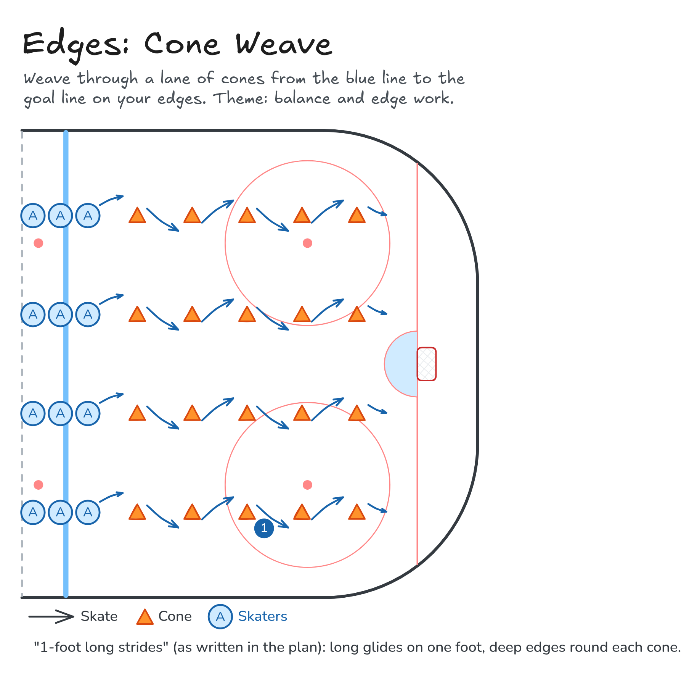

# Edges: Cone Weave

Weave through a lane of cones from the blue line to the goal line on your edges. Theme: balance and edge work.

**Tags:** `skating`

[All drills](../README.md) · [Drill page](cone-weave/) · [Animation](../media/cone-weave/cone-weave-anim.html) · [PNG](../media/cone-weave/cone-weave.png) · [Excalidraw](../media/cone-weave/cone-weave.excalidraw)

The drill page embeds the HTML animation. The PNG is the still diagram and the home-page thumbnail.

## Coaching points

- Long strides on one foot: glide and hold the edge round each cone.
- Knees bent and weight over the skate you are on.
- Inside and outside edges both: carve, don't step round the cone.
- Head up, eyes on the next cone.

## How it runs

1. Set up 3 or 4 lanes of cones from the blue line to the goal line.
2. The front of each line weaves through the cones on deep edges.
3. At the goal line, skate back up the outside to your line.
4. The next skater goes as soon as the one ahead passes the second cone.

Open the Excalidraw file above in [Excalidraw](https://excalidraw.com) to change the diagram.

