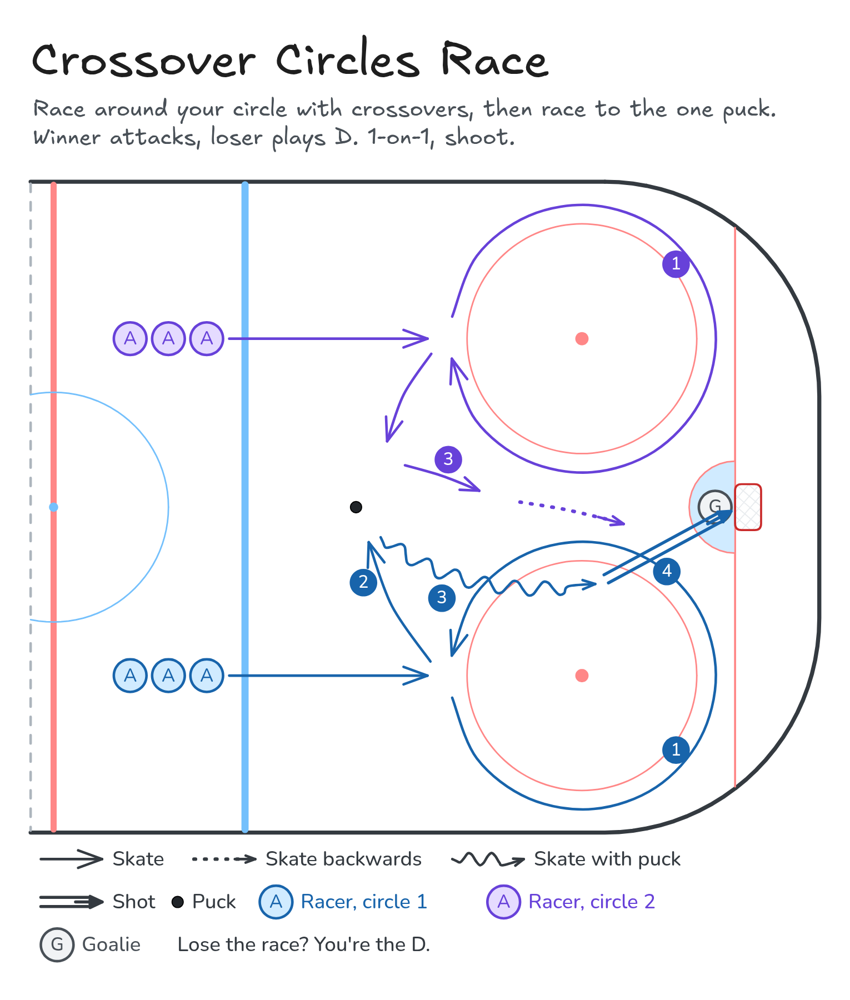

# Crossover Circles

Crossovers around the faceoff circles: 5 forwards, 5 backwards, then the same with pucks.

**Tags:** `skating`

[All drills](../README.md) · [Drill page](crossover-circles/) · [Animation](../media/crossover-circles/crossover-circles-anim.html) · [PNG](../media/crossover-circles/crossover-circles.png) · [Excalidraw](../media/crossover-circles/crossover-circles.excalidraw)

The drill page embeds the HTML animation. The PNG is the still diagram and the home-page thumbnail.

## Coaching points

- Knees bent and chest up. Push with the outside leg and cross the inside leg over.
- Lean into the circle and keep your stick on the ice.
- Backwards: stay low, keep your shoulders square, and push with the crossunder.
- With pucks: keep your head up and the puck out in front.

## How it runs

1. Split into one group per faceoff circle, lined up at the edge of the circle. Pucks sit behind the line.
2. Skate 5 circles forwards with crossovers.
3. Skate 5 circles backwards, going the other way.
4. Grab a puck and do the same again: 5 forwards, then 5 backwards.
5. Back to the line. The front of the line goes next.

Open the Excalidraw file above in [Excalidraw](https://excalidraw.com) to change the diagram.

