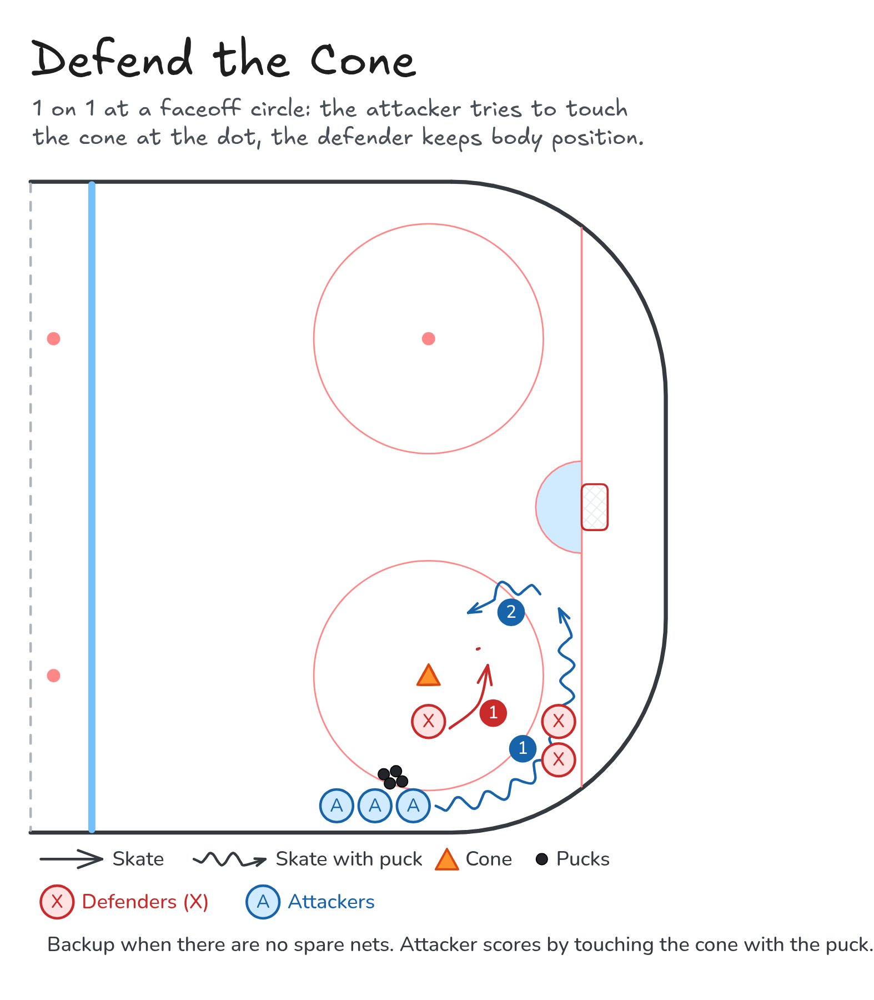

# Defend the Cone

1 on 1 at a faceoff circle: the attacker tries to touch the cone at the dot, the defender keeps body position.

**Tags:** `small-area-game`, `defence`

[All drills](../README.md) · [Drill page](defend-the-cone/index.html) · [Animation](../media/defend-the-cone/defend-the-cone-anim.html) · [PNG](../media/defend-the-cone/defend-the-cone.png) · [Excalidraw](../media/defend-the-cone/defend-the-cone.excalidraw)

The drill page embeds the HTML animation. The PNG is the still diagram and the home-page thumbnail.

## Coaching points

- Defender: stay between the attacker and the cone, stick on the puck.
- Use your angle, not a reach. Keep your feet moving.
- Attacker: protect the puck with your body and change speed to get inside.
- Variations: with or without a puck, with or without sticks.

## How it runs

1. Put a cone on the faceoff dot. One line of attackers and one line of defenders.
2. The attacker carries the puck around the circle. The defender mirrors from inside.
3. The attacker cuts in and tries to touch the cone with the puck. The defender angles them away.
4. Swap: the attacker joins the defender line and the defender joins the attack line.

Open the Excalidraw file above in [Excalidraw](https://excalidraw.com) to change the diagram.

