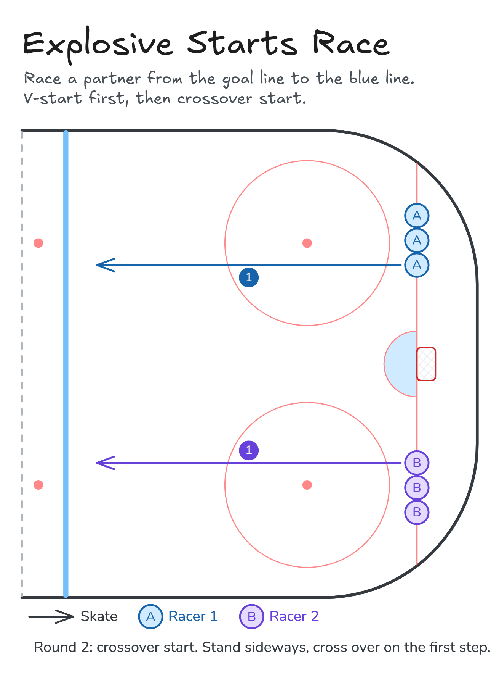

# Explosive Starts Race

Race a partner from the goal line to the blue line. V-start first, then crossover start.

**Tags:** `skating`

[All drills](../README.md) · [Drill page](explosive-starts-race/) · [Animation](../media/explosive-starts-race/explosive-starts-race-anim.html) · [PNG](../media/explosive-starts-race/explosive-starts-race.png) · [Excalidraw](../media/explosive-starts-race/explosive-starts-race.excalidraw)

The drill page embeds the HTML animation. The PNG is the still diagram and the home-page thumbnail.

## Coaching points

- V-start: heels together, toes out, short quick steps.
- Stay low and drive your knees forward.
- Crossover start: stand sideways, first step crosses over toward where you're going.
- Arms pump forward and back, not side to side.
- Race to the line, don't coast.

## How it runs

1. Two lines on the goal line, one on each side of the net.
2. Round 1: V-start. The front pair races to the blue line.
3. Glide back along the boards to the back of your line.
4. Round 2: crossover start. Stand sideways and cross over on your first step.
5. Switch lines so you race from both sides.

Open the Excalidraw file above in [Excalidraw](https://excalidraw.com) to change the diagram.

## Related drills

- [Stops and Starts](stops-and-starts.md)
- [Crossover Circles Race](crossover-circles.md)
- [Backward C-Cuts](backward-c-cuts.md)

