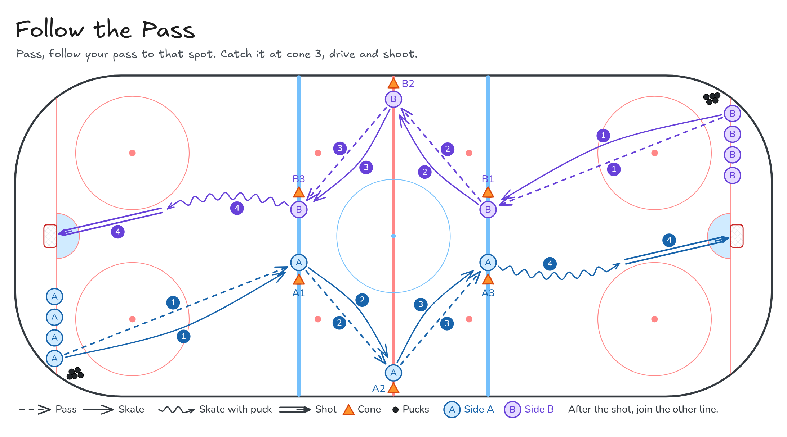

# Follow the Pass

Pass, follow your pass to that spot. Catch it at cone 3, drive and shoot.

**Tags:** `full-ice`, `passing`, `shooting`

[All drills](../README.md) · [Video page](follow-the-pass/index.html) · [MP4](../media/follow-the-pass/follow-the-pass.mp4) · [GIF](../media/follow-the-pass/follow-the-pass.gif) · [PNG](../media/follow-the-pass/follow-the-pass.png) · [Excalidraw](../media/follow-the-pass/follow-the-pass.excalidraw) · [Edit in Excalidraw](https://excalidraw.com/#json=yZtRxgmM5Zzl64BXsT1-y,DNP04A28RrNvco2lrc3lyQ)

The video page embeds the MP4 and uses this PNG as the poster. On GitHub, the MP4 link above opens the video. The GIF is the downloadable animation.

## Coaching points

- Full ice and two-sided. Both ends run at the same time.
- The front player starts at the boards and makes the first pass.
- Three cones per side: near blue line at centre, boards at the red line, far blue line at centre.
- Catch the puck at cone 3, drive the net, and shoot. Then join the line at the other end.

## How it runs

1. Set a line along each goal line. The first player in each line starts on the boards with a puck.
2. Place three cones on each side of the rink: centre ice at the near blue line, on the boards at the red line, and centre ice at the far blue line.
3. The front player passes to the next player in line, then follows that pass along the cones.
4. Each player who receives the puck passes it on and follows their own pass. Keep the puck and the skaters moving up the ice.
5. The player who catches the puck at cone 3 (far blue line, centre) drives the net and shoots.
6. After the shot, that player joins the line at the far end. The same pattern is already coming back the other way.

