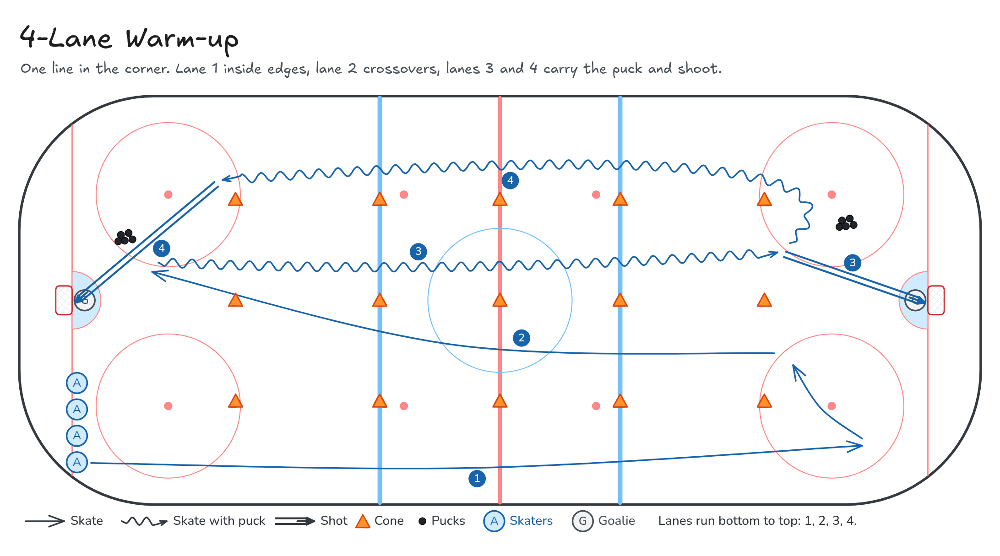

# 4-Lane Warm-up

One line in the corner. Lane 1 inside edges, lane 2 crossovers, lanes 3 and 4 carry the puck and shoot.

**Tags:** `full-ice`, `skating`, `shooting`

[All drills](../README.md) · [Drill page](four-lane-warmup/index.html) · [Animation](../media/four-lane-warmup/four-lane-warmup-anim.html) · [PNG](../media/four-lane-warmup/four-lane-warmup.png) · [Excalidraw](../media/four-lane-warmup/four-lane-warmup.excalidraw) · [Edit in Excalidraw](https://excalidraw.com/#json=6H_H1FHA3XMtYoFA_wdPI,jMK9cMTpa2-BUzVrkgGTMg)

The drill page embeds the HTML animation. The PNG is the still diagram and the home-page thumbnail.

## Coaching points

- Three rows of cones split the ice into four lanes. One line starts in the corner.
- Lane 1: inside edges, no crossovers. Lane 2: outside edges with crossovers.
- Lane 3: two hands on the stick, carry and shoot. Lane 4: one-handed carry, then shoot.
- Send the next player when the one ahead reaches the first cones.

## How it runs

1. Set three rows of cones the length of the ice to make four lanes. The line starts in the corner. Put pucks at each end.
2. Lane 1: skate down the ice on inside edges with no crossovers.
3. Lane 2: come back up the next lane using outside edges and crossovers.
4. Lane 3: pick up a puck, carry it two-handed down the lane, and shoot on the far net.
5. Lane 4: pick up a puck, carry it one-handed back up the last lane, and shoot on the near net.
6. Return to the line in the corner and repeat.

