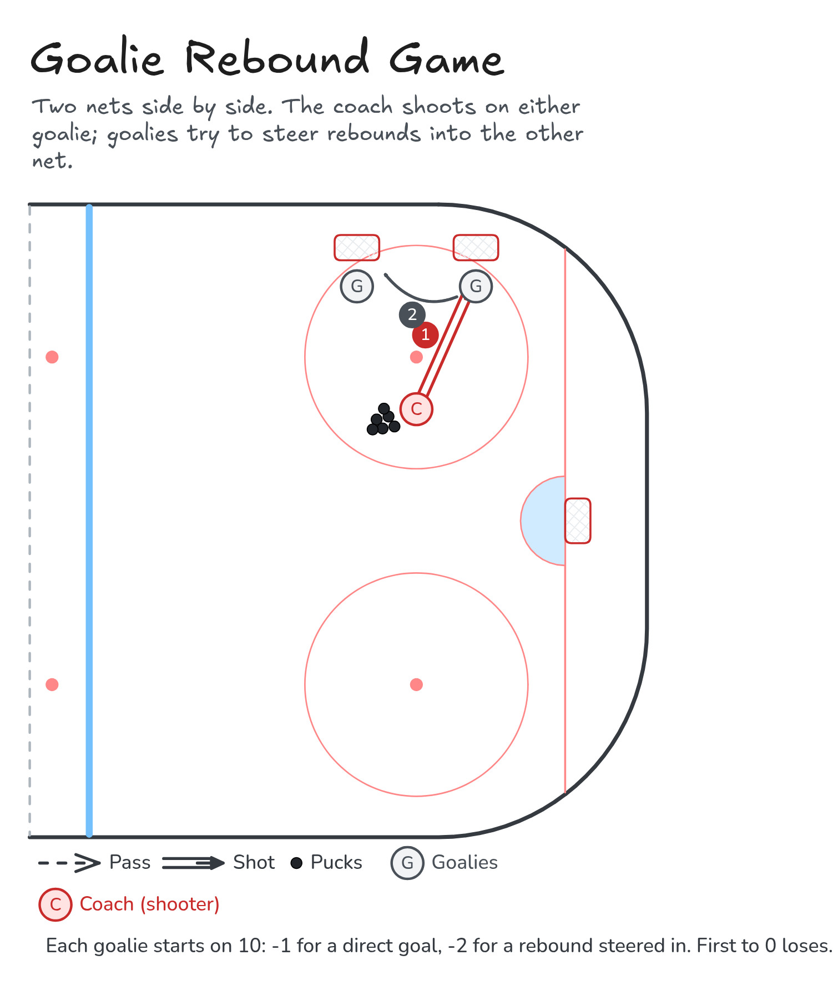

# Goalie Rebound Game

The coach shoots on one goalie. That goalie tries to steer the rebound into the other goalie's net.

**Tags:** `small-area-game`, `shooting`

[All drills](../README.md) · [Drill page](goalie-rebound-game/) · [Animation](../media/goalie-rebound-game/goalie-rebound-game-anim.html) · [PNG](../media/goalie-rebound-game/goalie-rebound-game.png) · [Excalidraw](../media/goalie-rebound-game/goalie-rebound-game.excalidraw) · [Edit in Excalidraw](https://excalidraw.com/#json=kNeWmKZpnBiY3kItD8jnG,jPaA7y939n9TMuOjUR1B2A)

The drill page embeds the HTML animation. The PNG is the still diagram and the home-page thumbnail.

## Coaching points

- Goalies: square up to the shooter and track the puck all the way in.
- Control the rebound with your pads and stick. Steer it, don't just block it.
- Recover fast: the other goalie can fire one back.
- Coach: vary the shots (low to the pads, glove side, blocker side).

## How it runs

1. Put two nets side by side, each with a goalie. The coach has pucks out front.
2. The coach shoots on one goalie.
3. That goalie tries to direct the rebound into the other goalie's net.
4. Alternate which goalie gets the shot.
5. Scoring: each goalie starts on 10. Lose 1 for a direct goal against you and 2 for a rebound steered into your net. First to 0 loses. Switch nets after 5-10 shots.

