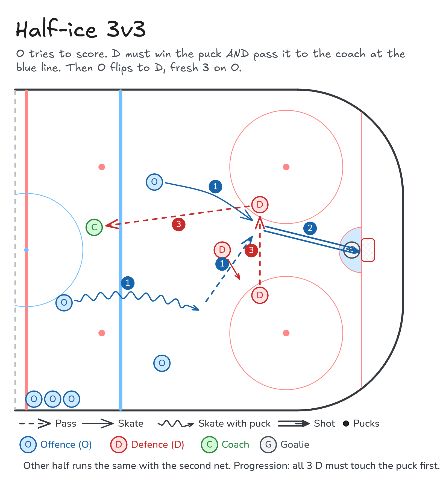

# Half-ice 3v3

O tries to score. D must win the puck AND pass it to the coach at the blue line. Then O flips to D, fresh 3 on O.

**Tags:** `small-area-game`, `half-ice`, `defence`

[All drills](../README.md) · [Drill page](half-ice-3v3/) · [Animation](../media/half-ice-3v3/half-ice-3v3-anim.html) · [PNG](../media/half-ice-3v3/half-ice-3v3.png) · [Excalidraw](../media/half-ice-3v3/half-ice-3v3.excalidraw)

The drill page embeds the HTML animation. The PNG is the still diagram and the home-page thumbnail.

## Coaching points

- O: support the puck carrier and get someone to the net.
- D: win the puck, then move it quickly and with control to the coach.
- Talk: who has the puck carrier, who has the net front.
- Change fast so the next group can start right away.

## How it runs

1. Use each half of the ice with a net in its normal spot. The coach stands at the blue line.
2. 3 O try to score on 3 D.
3. The D must win the puck and pass it to the coach.
4. When the coach has the puck, the D come off, the O flip to D, and 3 fresh skaters come on as O.
5. Progression: all 3 D must touch the puck before passing to the coach.

Open the Excalidraw file above in [Excalidraw](https://excalidraw.com) to change the diagram.

