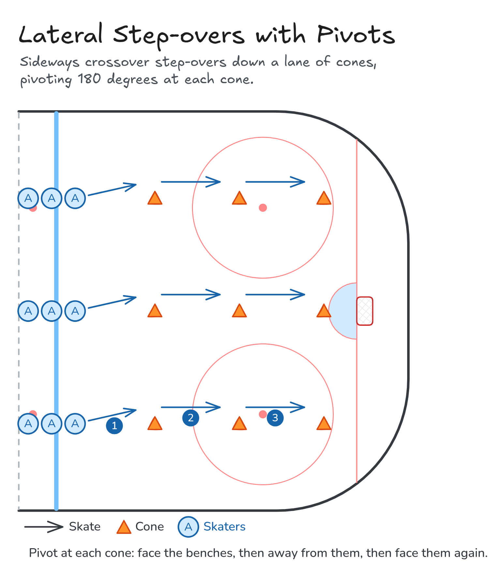

# Lateral Step-overs with Pivots

Sideways crossover step-overs down a lane of cones, pivoting 180 degrees at each cone.

**Tags:** `skating`

[All drills](../README.md) · [Drill page](lateral-step-overs/) · [Animation](../media/lateral-step-overs/lateral-step-overs-anim.html) · [PNG](../media/lateral-step-overs/lateral-step-overs.png) · [Excalidraw](../media/lateral-step-overs/lateral-step-overs.excalidraw)

The drill page embeds the HTML animation. The PNG is the still diagram and the home-page thumbnail.

## Coaching points

- Stay low and step the trailing leg over the lead leg.
- Shoulders and hips stay square to the way you are facing.
- Quick, tight pivots at each cone: don't drift past it.
- Keep your stick on the ice in front of you.

## How it runs

1. Set up lanes of cones from the blue line to the goal line.
2. Step over sideways to the first cone, facing the benches.
3. Pivot and step over to the second cone, facing away from the benches.
4. Pivot and step over to the third cone, facing the benches again.
5. Skate back up the outside to your line.

Open the Excalidraw file above in [Excalidraw](https://excalidraw.com) to change the diagram.

