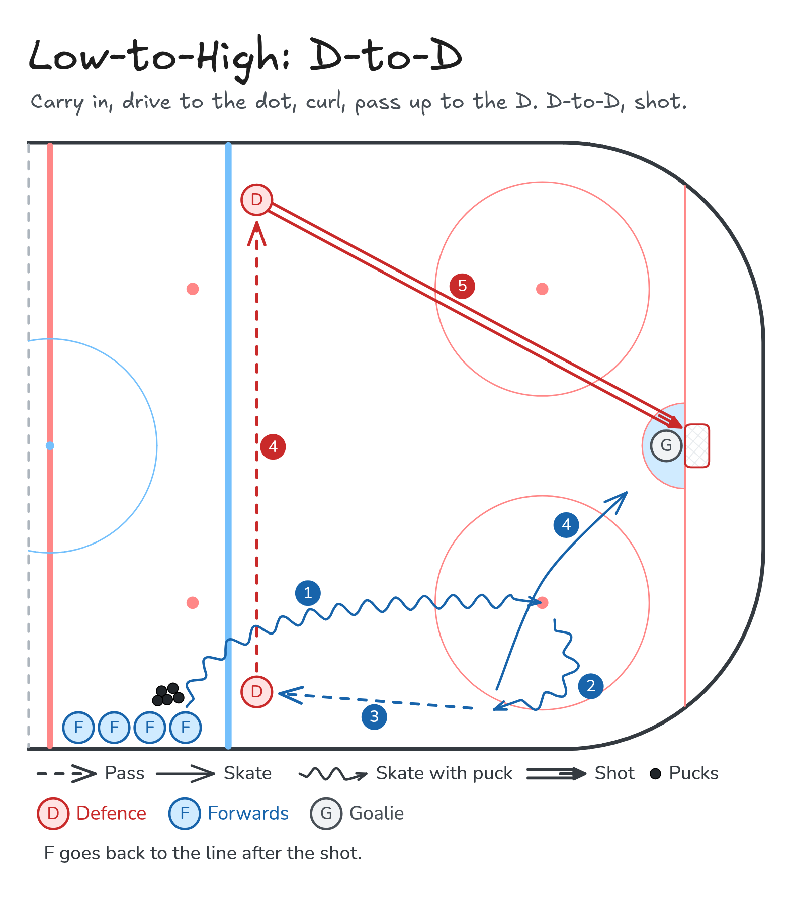

# Low-to-High: D-to-D

Carry in, drive to the dot, curl, pass up to the D. D-to-D, shot.

**Tags:** `half-ice`, `zone-entry`, `passing`, `shooting`, `defence`

Same entry for every low-to-high drill: carry in, drive to the dot, curl toward the boards, and pass up the wall. Only the finish changes.

[All drills](../README.md) · [Video page](low-to-high-d-to-d/index.html) · [MP4](../media/low-to-high-d-to-d/low-to-high-d-to-d.mp4) · [GIF](../media/low-to-high-d-to-d/low-to-high-d-to-d.gif) · [PNG](../media/low-to-high-d-to-d/low-to-high-d-to-d.png) · [Excalidraw](../media/low-to-high-d-to-d/low-to-high-d-to-d.excalidraw) · [Edit in Excalidraw](https://excalidraw.com/#json=bSyjPWAizPxD8DlFI9vmA,zrpEIlD7lgwLffcBUvRNrA)

The video page embeds the MP4 and uses this PNG as the poster. On GitHub, the MP4 link above opens the video. The GIF is the downloadable animation.

## Coaching points

- Same forward entry, with two defence on the ice.
- Bottom D is on the strong-side wall and moves the puck. Top D is across the blue line and shoots.
- The D-to-D pass stays up near the blue line, firm and flat.
- The forward screens the goalie, stick on the ice, then clears the front.

## How it runs

1. Forwards line up outside the blue line with pucks. Bottom defence stands inside the blue line on the boards side of the entry. Top defence stands on the far side of the blue line.
2. Carry in, drive to the faceoff dot, and curl toward the boards.
3. Pass low-to-high to the bottom defence.
4. Bottom defence passes across the blue line to the top defence.
5. Top defence shoots. The forward drives the net and screens the goalie.
6. Clear the front of the net and return to the back of the line.

## Same series

- [Low-to-High: D Shot](low-to-high-shot.md)
- [Low-to-High: Give-and-Go](low-to-high-give-and-go.md)

