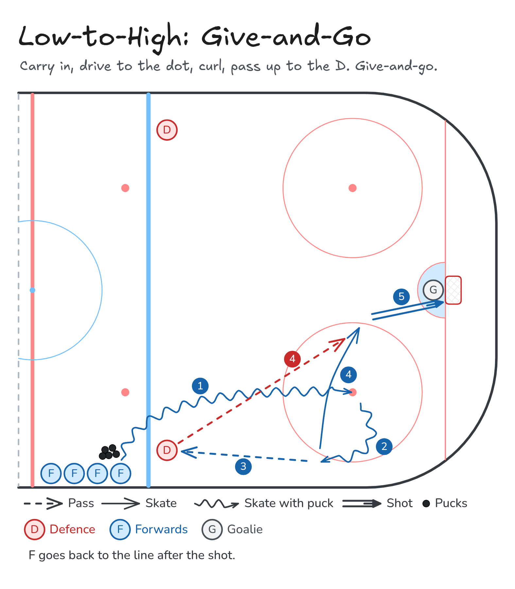

# Low-to-High: Give-and-Go

Carry in, drive to the dot, curl, pass up to the D. Give-and-go.

**Tags:** `half-ice`, `zone-entry`, `passing`, `shooting`, `defence`

Same entry for every low-to-high drill: carry in, drive to the dot, curl toward the boards, and pass up the wall. Only the finish changes.

[All drills](../README.md) · [Video page](low-to-high-give-and-go/index.html) · [MP4](../media/low-to-high-give-and-go/low-to-high-give-and-go.mp4) · [GIF](../media/low-to-high-give-and-go/low-to-high-give-and-go.gif) · [PNG](../media/low-to-high-give-and-go/low-to-high-give-and-go.png) · [Excalidraw](../media/low-to-high-give-and-go/low-to-high-give-and-go.excalidraw) · [Edit in Excalidraw](https://excalidraw.com/#json=PKA09mlyorcRyYW7XvmM5,sz7tsIEBbCT4iNpaD84QZA)

The video page embeds the MP4 and uses this PNG as the poster. On GitHub, the MP4 link above opens the video. The GIF is the downloadable animation.

## Coaching points

- Use the same entry as D Shot: carry, dot, curl, pass up the wall.
- The forward leaves as the pass goes. The cut to the slot starts with the pass.
- Defence returns the puck. One touch back if it is there.
- The forward shoots from the slot, then returns to the line.

## How it runs

1. Set it up like Low-to-High: D Shot. Forwards outside the blue line, one defence inside on the strong-side wall.
2. Carry in, drive to the faceoff dot, and curl toward the boards.
3. Pass low-to-high to the defence.
4. As soon as the pass leaves your stick, cut to the slot.
5. Defence passes the puck back to the forward on that cut.
6. The forward shoots, then returns to the back of the line.

## Same series

- [Low-to-High: D Shot](low-to-high-shot.md)
- [Low-to-High: D-to-D](low-to-high-d-to-d.md)

