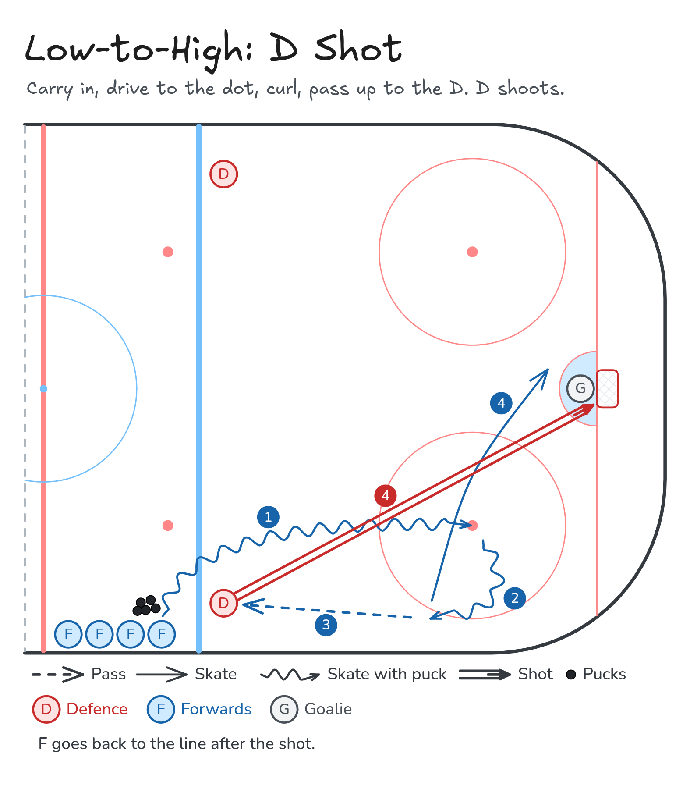

# Low-to-High: D Shot

Carry in, drive to the dot, curl, pass up to the D. D shoots.

**Tags:** `half-ice`, `zone-entry`, `passing`, `shooting`, `defence`

Same entry for every low-to-high drill: carry in, drive to the dot, curl toward the boards, and pass up the wall. Only the finish changes.

[All drills](../README.md) · [Drill page](low-to-high-shot/index.html) · [Animation](../media/low-to-high-shot/low-to-high-shot-anim.html) · [PNG](../media/low-to-high-shot/low-to-high-shot.png) · [Excalidraw](../media/low-to-high-shot/low-to-high-shot.excalidraw)

The drill page embeds the HTML animation. The PNG is the still diagram and the home-page thumbnail.

## Coaching points

- Half-ice zone entry with one defence inside the blue line.
- Carry in with speed, drive to the faceoff dot, then curl toward the boards.
- The pass is low-to-high: from the curl, up the wall, onto the defence.
- Defence shoots. The forward drives the net front, then returns to the line.

## How it runs

1. Forwards line up just outside the blue line with pucks. One defence stands inside the blue line, on the boards side of the entry.
2. Carry the puck over the blue line and drive toward the faceoff dot.
3. At the dot, curl toward the boards so you are looking back up the wall.
4. Pass low-to-high, up the boards, to the defence.
5. The defence catches and shoots. Drive to the front of the net for a tip or a rebound.
6. Leave the net and return to the back of the line. The next forward goes.

Open the Excalidraw file above in [Excalidraw](https://excalidraw.com) to change the diagram.

## Same series

- [Low-to-High: Give-and-Go](low-to-high-give-and-go.md)
- [Low-to-High: D-to-D](low-to-high-d-to-d.md)
- [Zone Entries: Delay](zone-entry-delay.md)

