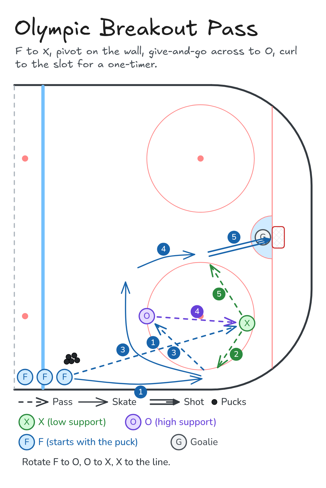
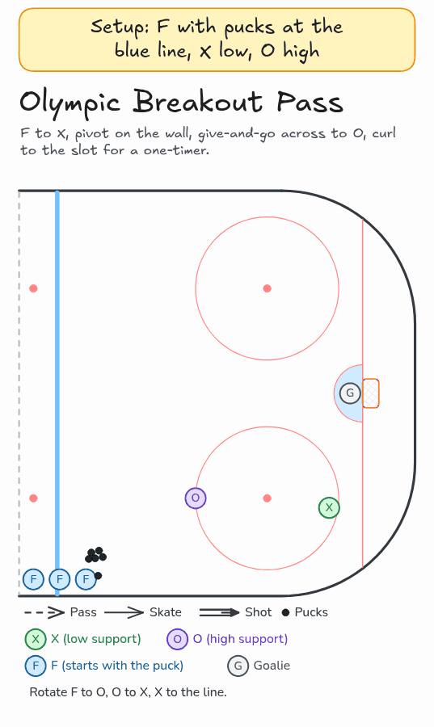

# Olympic Breakout Pass

F to X, pivot on the wall, give-and-go across to O, curl to the slot for a one-timer.

**Tags:** `passing`, `shooting`, `breakout`

[All drills](../README.md) · [Drill page](olympic-breakout-pass/index.html) · [GIF](../media/olympic-breakout-pass/olympic-breakout-pass.gif) · [PNG](../media/olympic-breakout-pass/olympic-breakout-pass.png) · [Excalidraw](../media/olympic-breakout-pass/olympic-breakout-pass.excalidraw) · [Edit in Excalidraw](https://excalidraw.com/#json=1Cttzcue5rLcbEE9KRBvl,fSHHU7jO5wDHNoktif0FRw)

The drill page shows this GIF. The PNG is the still diagram and the home-page thumbnail.

## Coaching points

- Groups of three: F with the puck near the blue line, X low support, O high support at the top of the circle.
- Pivot tight to the boards below the hash marks and show a target for the return pass.
- Make the pass across to O on one touch, then curl over the top of the circle into the slot.
- Keep it moving with no whistles. Rotate F to O, O to X, and X to the line.

## How it runs

1. F starts near the blue line with the puck. X stands low at the bottom of the faceoff circle and O stands high at the top of the circle.
2. F passes to X and skates tight down the boards.
3. F pivots below the hash marks and X passes the puck back.
4. F one-touches the puck across to O, then curls over the top of the circle.
5. O passes down to X while F cuts into the slot.
6. X feeds F in the slot for a one-timer on goal.
7. Rotate: F takes O's spot, O takes X's spot, and X goes to the back of the line. The next F goes right away.

## Related drills

- [Zone Exits: Bounce Pass](zone-exit-bounce-pass.md)

