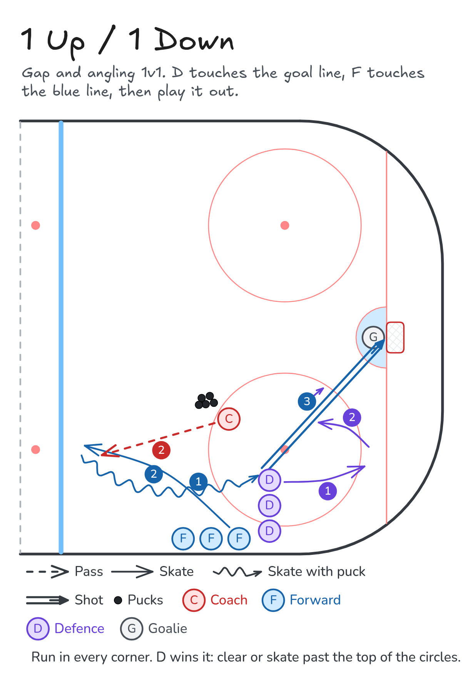

# 1 Up / 1 Down

Gap and angling 1v1. D touches the goal line, F touches the blue line, then play it out.

**Tags:** `defence`, `small-area-game`

[All drills](../README.md) · [Drill page](one-up-one-down/index.html) · [Animation](../media/one-up-one-down/one-up-one-down-anim.html) · [PNG](../media/one-up-one-down/one-up-one-down.png) · [Excalidraw](../media/one-up-one-down/one-up-one-down.excalidraw)

The drill page embeds the HTML animation. The PNG is the still diagram and the home-page thumbnail.

## Coaching points

- Use all four corners. Corners that share a net take turns.
- D: head up before you turn up ice, close the gap, and lead with your stick to steer the forward to the outside.
- F: look before you turn to attack, use speed and fakes, and protect the puck on the way to the net.
- F gets one shot and one rebound. If the D steals it, clear it or skate it past the top of the circles.

## How it runs

1. Set a forward line and a defence line in the corner. The coach stands near the top of the circle with pucks.
2. On the coach's 'Go', the D skates down and touches the goal line while the F skates up and touches the blue line.
3. The coach puts the puck in to the forward.
4. The forward attacks the net. The D steps up, closes the gap, and angles the forward to the outside.
5. The forward gets one shot and one rebound. If the D wins the puck, they clear it or skate it past the top of the circles.
6. Flip roles: the forward joins the D line and the D joins the F line. Halfway through, swap corners for new matchups.

Open the Excalidraw file above in [Excalidraw](https://excalidraw.com) to change the diagram.

