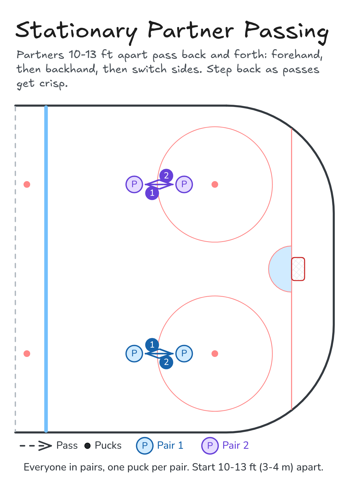

# Stationary Partner Passing

Partners 10-13 ft apart pass back and forth: forehand, then backhand, then switch sides. Step back as passes get crisp.

**Tags:** `passing`

[All drills](../README.md) · [Drill page](stationary-partner-passing/) · [Animation](../media/stationary-partner-passing/stationary-partner-passing-anim.html) · [PNG](../media/stationary-partner-passing/stationary-partner-passing.png) · [Excalidraw](../media/stationary-partner-passing/stationary-partner-passing.excalidraw) · [Edit in Excalidraw](https://excalidraw.com/#json=xMvVjvCJChlDuDz-PcGzO,udng8Sg37DOB2i0mem5KFw)

The drill page embeds the HTML animation. The PNG is the still diagram and the home-page thumbnail.

## Coaching points

- Give a target: blade square to your partner, stick on the ice.
- Sweep the puck, don't slap it. Follow through to your target.
- Cushion the pass as it arrives: soft hands, let the blade give.
- Eyes up: look at your partner before you pass.
- Backhand too: cup the puck and follow through low.

## How it runs

1. Everyone pairs up with one puck, partners facing each other 10-13 ft (3-4 m) apart.
2. Pass forehand to your partner.
3. Your partner cushions it and passes it back.
4. After 10 good passes, switch to backhand passes, then swap sides so you both work forehand and backhand.
5. When the passes are crisp, both take a step back and keep going.

## Related drills

- [Rondo Passing Progressions](rondo-passing.md)

