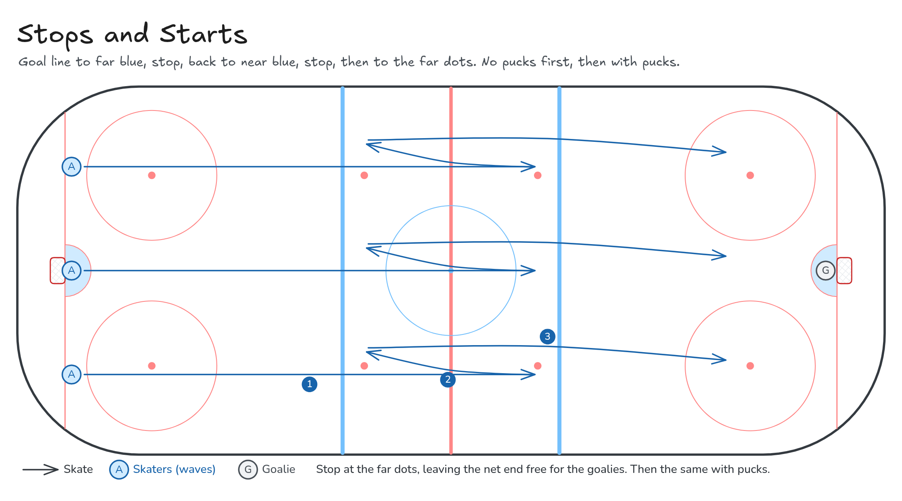

# Stops and Starts

Goal line to far blue, stop, back to near blue, stop, then to the far dots. No pucks first, then with pucks.

**Tags:** `skating`, `full-ice`

[All drills](../README.md) · [Drill page](stops-and-starts/) · [Animation](../media/stops-and-starts/stops-and-starts-anim.html) · [PNG](../media/stops-and-starts/stops-and-starts.png) · [Excalidraw](../media/stops-and-starts/stops-and-starts.excalidraw)

The drill page embeds the HTML animation. The PNG is the still diagram and the home-page thumbnail.

## Coaching points

- Hard two-foot stops: knees bent, weight on the edges, shoulders level.
- Explode out of each stop with short, quick first strides.
- Stop facing the same way each time, then switch sides on the next rep.
- With pucks: keep the puck close through the stop and the restart.

## How it runs

1. Skaters start in waves on the goal line.
2. Sprint to the far blue line and stop hard.
3. Sprint back to the near blue line and stop hard.
4. Sprint to the far faceoff dots and stop. Leave the net end free for the goalies.
5. Run it without pucks first, then the same with pucks.

Open the Excalidraw file above in [Excalidraw](https://excalidraw.com) to change the diagram.

