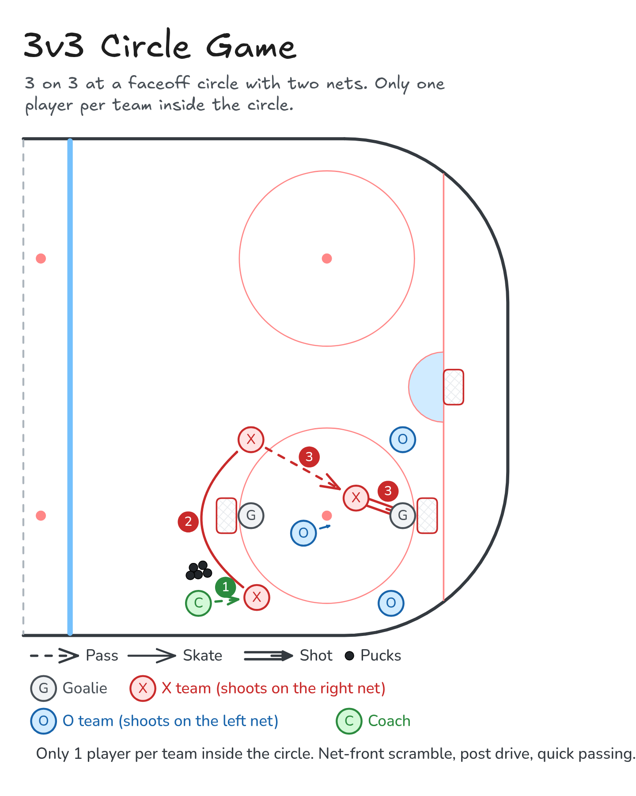

# 3v3 Circle Game

3 on 3 at a faceoff circle with two nets. Only one player per team inside the circle.

**Tags:** `small-area-game`, `passing`, `shooting`

[All drills](../README.md) · [Drill page](three-v-three-circle-game/) · [Animation](../media/three-v-three-circle-game/three-v-three-circle-game-anim.html) · [PNG](../media/three-v-three-circle-game/three-v-three-circle-game.png) · [Excalidraw](../media/three-v-three-circle-game/three-v-three-circle-game.excalidraw)

The drill page embeds the HTML animation. The PNG is the still diagram and the home-page thumbnail.

## Coaching points

- Inside player: get open, stick on the ice, and be ready for a quick shot or a tip.
- Outside players: move the puck quickly and look for the inside pass first.
- Drive the post and fight for net-front position.
- Only one player per team in the circle at a time.

## How it runs

1. Put two nets facing each other inside a faceoff circle, with a goalie in each.
2. Three per team: one inside the circle, two outside. Only one player per team may be inside.
3. The coach puts a puck in.
4. Outside players pass it around and try to get it to their inside player. They can shoot too.
5. Play short shifts and change on the coach's whistle. Optional, if time allows.

Open the Excalidraw file above in [Excalidraw](https://excalidraw.com) to change the diagram.

