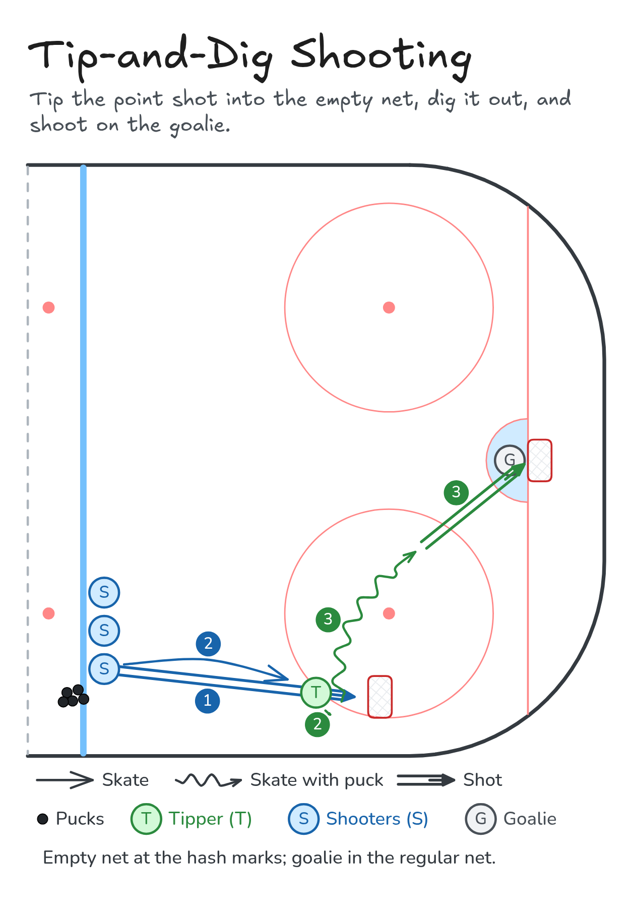

# Tip-and-Dig Shooting

Tip the point shot into the empty net, dig it out, and shoot on the goalie.

**Tags:** `shooting`

[All drills](../README.md) · [Drill page](tip-and-dig-shooting/index.html) · [Animation](../media/tip-and-dig-shooting/tip-and-dig-shooting-anim.html) · [PNG](../media/tip-and-dig-shooting/tip-and-dig-shooting.png) · [Excalidraw](../media/tip-and-dig-shooting/tip-and-dig-shooting.excalidraw) · [Edit in Excalidraw](https://excalidraw.com/#json=963ZHchOsI-Ys_CZvIBWr,mw1tUKfsvbjCyeP7MTChCA)

The drill page embeds the HTML animation. The PNG is the still diagram and the home-page thumbnail.

## Coaching points

- Put an empty net at the hash marks. The goalie stays in the regular net on the goal line.
- Tipper: stick on the ice and redirect the point shot into the empty net.
- Dig the puck out of the net quickly, then attack the slot and shoot on the goalie.
- Run it in both corners at the same time if you have the ice.

## How it runs

1. Place an empty net at the hash marks. One player stands in front of it as the tipper. The shooters line up at the blue line with pucks.
2. The first shooter shoots from the blue line and the tipper deflects it into the empty net.
3. The tipper digs the puck out of the empty net while the shooter moves in to become the next tipper.
4. The tipper carries into the slot and shoots on the goalie.
5. After the shot, go to the back of the shooting line. The next shooter goes.

