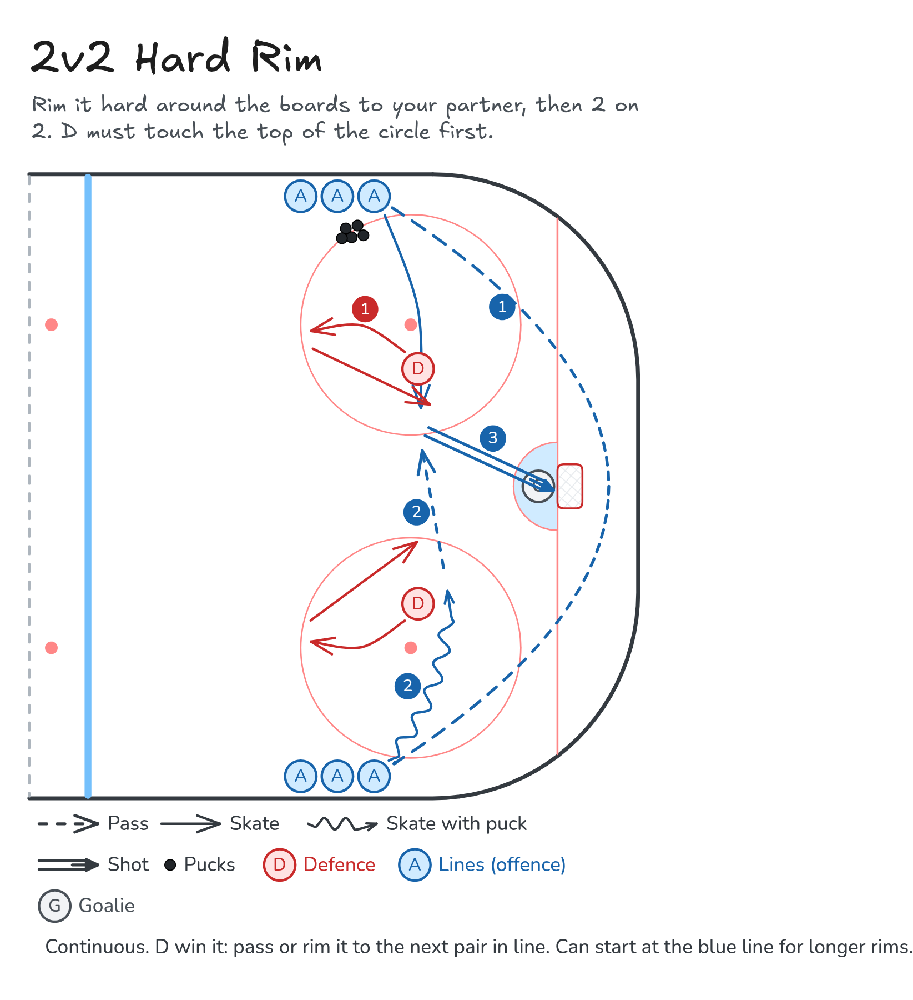

# 2v2 Hard Rim

Rim it hard around the boards to your partner, then 2 on 2. D must touch the top of the circle first.

**Tags:** `small-area-game`, `passing`, `defence`

[All drills](../README.md) · [Drill page](two-v-two-hard-rim/index.html) · [Animation](../media/two-v-two-hard-rim/two-v-two-hard-rim-anim.html) · [PNG](../media/two-v-two-hard-rim/two-v-two-hard-rim.png) · [Excalidraw](../media/two-v-two-hard-rim/two-v-two-hard-rim.excalidraw)

The drill page embeds the HTML animation. The PNG is the still diagram and the home-page thumbnail.

## Coaching points

- Rim it hard and high on the glass side so it gets all the way around.
- Receiver: get to the wall early, stop the puck with your skate or stick, and look up.
- D: touch the top of the circle, then attack fast and take away the middle.
- Play it out: second chances and rebounds count.

## How it runs

1. Two lines of forwards with pucks at the hash marks on each wall. Two D start at the dots.
2. The first forward rims the puck hard behind the net to the forward at the front of the other line.
3. The D must skate up and touch the top of the circle before they can play.
4. The forwards play 2 on 2 to the net.
5. If the D win the puck, they pass or rim it to the next pair in line. Then the D go out and the O become D.
6. Start from the blue line for longer rims. Run the same drill on the other side of the ice.

Open the Excalidraw file above in [Excalidraw](https://excalidraw.com) to change the diagram.

