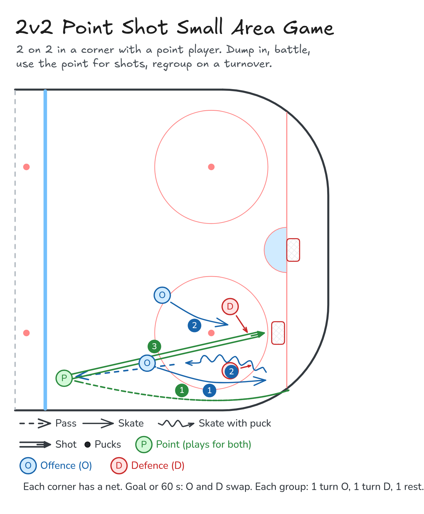

# 2v2 Point Shot Small Area Game

2 on 2 in a corner with a point player. Dump in, battle, use the point for shots, regroup on a turnover.

**Tags:** `small-area-game`, `shooting`, `defence`

[All drills](../README.md) · [Drill page](two-v-two-point-shot/index.html) · [Animation](../media/two-v-two-point-shot/two-v-two-point-shot-anim.html) · [PNG](../media/two-v-two-point-shot/two-v-two-point-shot.png) · [Excalidraw](../media/two-v-two-point-shot/two-v-two-point-shot.excalidraw)

The drill page embeds the HTML animation. The PNG is the still diagram and the home-page thumbnail.

## Coaching points

- Win the race to the puck and protect it along the wall.
- Use the point: move it up, then get to the net for tips and rebounds.
- On a turnover, regroup to the point before you attack.
- D: stick on puck, body on body, and clear the front of the net.

## How it runs

1. Put a net in each corner. Groups of 5 per net: 2 O, 2 D and 1 point player (or a coach at the point with groups of 4).
2. The point dumps the puck into the corner and the 2v2 starts.
3. The team with the puck can pass up to the point for a shot.
4. On a change of possession, move the puck up to the point before attacking.
5. Goal or 60 seconds: O and D swap. Each group gets 1 turn on O, 1 on D and 1 rest.

Open the Excalidraw file above in [Excalidraw](https://excalidraw.com) to change the diagram.

