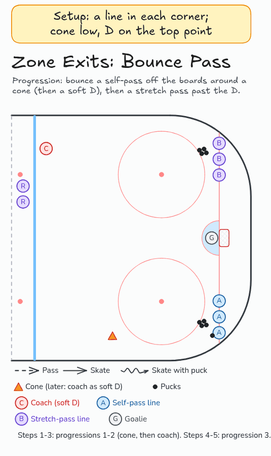

# Zone Exits: Bounce Pass

Bounce a self-pass off the boards around a cone, then a soft D, then a stretch pass past the D.

**Tags:** `passing`, `breakout`

[All drills](../README.md) · [Drill page](zone-exit-bounce-pass/index.html) · [GIF](../media/zone-exit-bounce-pass/zone-exit-bounce-pass.gif) · [PNG](../media/zone-exit-bounce-pass/zone-exit-bounce-pass.png) · [Excalidraw](../media/zone-exit-bounce-pass/zone-exit-bounce-pass.excalidraw) · [Edit in Excalidraw](https://excalidraw.com/#json=LYlXdSwxemY2ccKBTi6_0,j1BlMvOLs4v_knxBVl3tlQ)

The drill page shows this GIF. The PNG is the still diagram and the home-page thumbnail.

## Coaching points

- Progression 1: bank the puck off the boards past a cone, skate around it, and pick it up.
- Progression 2: replace the cone with a coach as a soft D. Same self-pass, now with pressure.
- Progression 3: bounce a stretch pass off the boards to a teammate for the exit.
- Pick the angle and weight so the D holding the blue line can't pick the pass off.

## How it runs

1. Set a line in each corner on the goal line with pucks. Place a cone low on one wall. A coach stands at the point on the other side.
2. The first player carries up the wall toward the cone.
3. Bank the puck off the boards past the cone, skate around the inside of the cone, pick it up, and exit over the blue line.
4. Progression 2: the coach replaces the cone as a soft defender. Bounce it past them the same way.
5. Progression 3: the player in the other corner carries up the wall while a teammate swings to the boards at the blue line.
6. Bank a stretch pass off the boards past the D to the teammate, who carries it out.
7. Players switch lines and the next pair goes.

## Related drills

- [Olympic Breakout Pass](olympic-breakout-pass.md)

